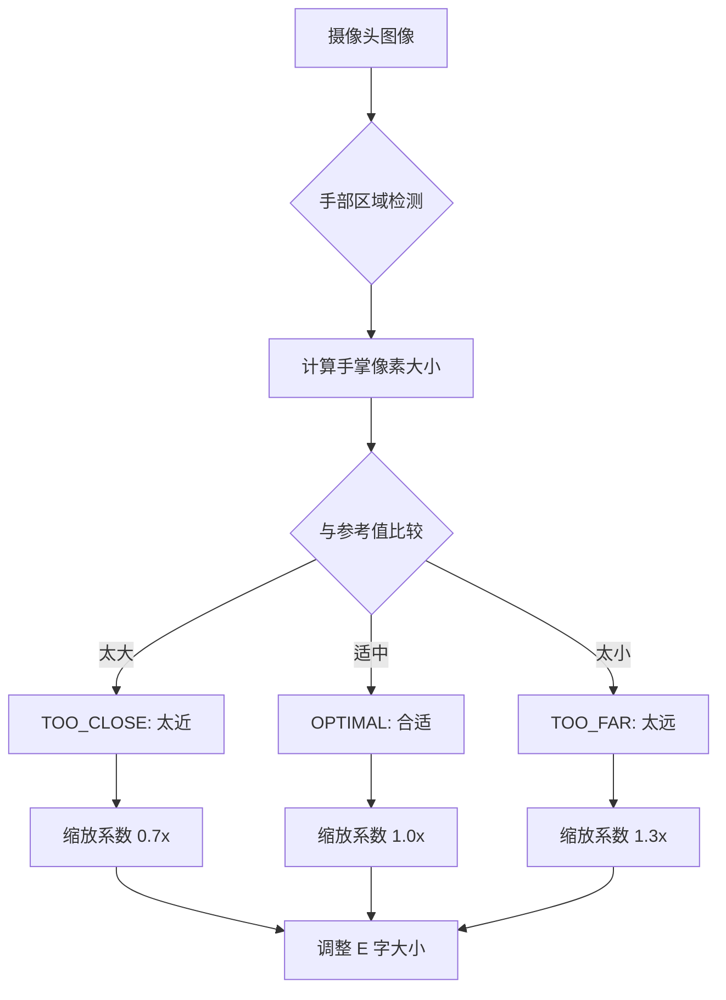

# 🎯 VisionTest v1.2.0 功能说明文档

## 一、距离自适应检测系统

### 1.1 工作原理



### 1.2 距离判断逻辑

**参考标准：**
- 成年人手掌宽度：约 8-10cm（实际物理尺寸）
- 标准测试距离：50cm
- 图像中手掌参考大小：基于标准距离下的理论值

**判断规则：**
```kotlin
if (actualHandSize > reference * 1.5) {
    return DistanceEstimate.TOO_CLOSE   // 实际大小 > 参考×1.5 → 太近
} else if (actualHandSize < reference * 0.5) {
    return DistanceEstimate.TOO_FAR     // 实际大小 < 参考×0.5 → 太远
} else {
    return DistanceEstimate.OPTIMAL     // 在合理范围内 → 合适
}
```

**阈值解释：**
- **太近 (<40cm)**: 手掌在图像中显得很大，视标会变小避免遮挡
- **合适 (40-60cm)**: 标准测试距离，使用标准大小的视标
- **太远 (>70cm)**: 手掌在图像中很小，视标会变大确保可见

### 1.3 应用场景

#### 场景 1：用户靠得太近
```
症状：E 字显示非常大，几乎占满屏幕
解决：自动缩小至 0.7 倍，同时显示"请远离屏幕一点！"提示
效果：保持舒适的观看体验，不会因视标过大而无法看清细节
```

#### 场景 2：用户坐得太远
```
症状：E 字显示过小，难以辨认
解决：自动放大至 1.3 倍，同时显示"请靠近一点！"提示
效果：视标变得更清晰，帮助用户正确测试视力
```

---

## 二、挥手识别算法详解

### 2.1 挥手动作特征

**定义：** 左右摆动手掌表示"没看到/看不清"E 字

**关键指标：**
1. **水平主导**：X 轴位移 > Y 轴位移 × 2
2. **最小幅度**：总位移 ≥ 50 像素
3. **方向切换**：至少发生一次从左到右或从右到左的变化
4. **持续时间**：≥ 300ms（避免误判为快速滑动）
5. **速度范围**：200-800 像素/秒

### 2.2 检测流程

```kotlin
fun checkWaveAction(currentX, currentY, timestamp):
    deltaX = currentX - startX
    deltaY = currentY - startY
    
    // 检查是否主要是水平运动
    if abs(deltaX) > 50 && abs(deltaX) > abs(deltaY) * 2:
        
        direction = sign(deltaX)  // -1 向左，1 向右
        
        if lastDirection != 0 and lastDirection != direction:
            // 检测到方向切换 → 可能是挥手
            
            if waveHistory not empty:
                status = WAVING_BOTH  // 完整挥手动作
            else:
                status = direction > 0 ? RIGHT : LEFT
                
            recordWaveEvent(timestamp)
            
        elif lastDirection == 0:
            // 新的挥手动开始
            startNewWave(timestamp, direction)
```

### 2.3 状态机设计

```
IDLE (空闲)
  ↓ [检测到手部移动且主要是水平]
WAVING_LEFT / WAVING_RIGHT (单向挥动)
  ↓ [检测到方向切换]
WAVING_BOTH (双向挥动 - 完整挥手)
  ↓ [确认完成]
发送挥手事件 → 记录"没看到"结果
  ↓ [重置]
回到 IDLE
```

---

## 三、手势类型对比表

### 3.1 三种手势行为

| 手势类型 | 触发条件 | 响应操作 | 进入下一行 | UI 反馈 |
|---------|---------|---------|-----------|--------|
| **滑动** | 手指在屏幕上划动 | 视为"看到了"E 字方向 | ✅ 是 | 绿色✓标记 |
| **挥手** | 左右摆动手掌（无需接触屏幕） | 视为"没看到"E 字 | ❌ 否 | 红色❌标记 + 重新尝试 |
| **无操作** | 长时间无输入 | 不记录 | ❌ 否 | 无变化 |

### 3.2 使用场景示例

**正常测试流程（看到 E 字时）：**
```
第 1 行（最大）→ 看到朝上 → ⬆️向上滑 → 进入第 2 行
第 2 行 → 看到朝左 → ⬅️向左滑 → 进入第 3 行
第 3 行 → 看不清 → 🖐️左右挥手 → 停留在第 3 行重试
第 3 行（调整后）→ 看到朝右 → ➡️向右滑 → 进入第 4 行
```

**异常处理流程（距离不当）：**
```
启动测试
  ↓
检测到手太近 (<40cm)
  ↓
显示警告："请远离屏幕一点！"
  ↓
自动缩小视标 (0.7x)
  ↓
提醒用户可以开始测试
```

---

## 四、技术实现细节

### 4.1 核心类结构

```kotlin
// 主要检测器类
class DistanceAndGestureDetector {
    // 距离检测
    private var distanceEstimate: DistanceEstimate = UNKNOWN
    private var lastHandSize: Float = 0f
    
    // 挥手检测
    private var waveStatus: WaveStatus = IDLE
    private var waveHistory: List<SwipePoint> = []
    
    // 滑动检测
    private var gestureStartX: Float? = null
    private var lastValidGesture: SwipeGestureType = NONE
    
    // 公共方法
    fun analyzeImage(imageProxy): 
        - 提取手部信息
        - 更新距离估计
        - 检查挥手动作
        - 检测滑动动作
        
    fun getScaleFactorForDistance(): Float
    fun getCurrentWaveStatus(): WaveStatus
    fun getCurrentSwipeGesture(): SwipeGestureType
}
```

### 4.2 数据结构

```kotlin
// 距离估算结果
enum class DistanceEstimate {
    TOO_CLOSE,    // 太近 (<40cm)
    OPTIMAL,      // 合适 (40-60cm)  
    TOO_FAR,      // 太远 (>70cm)
    UNKNOWN       // 无法判断
}

// 挥手状态
enum class WaveStatus {
    IDLE,           // 未检测到挥手
    WAVING_LEFT,    // 向左挥动
    WAVING_RIGHT,   // 向右挥动
    WAVING_BOTH     // 双向挥动（完整挥手）
}

// 滑动方向
enum class SwipeGestureType {
    SWIPE_UP,      // 向上滑 → E 口朝上
    SWIPE_DOWN,    // 向下滑 → E 口朝下
    SWIPE_LEFT,    // 向左滑 → E 口朝左
    SWIPE_RIGHT,   // 向右滑 → E 口朝右
    NONE
}

// 跟踪数据
data class SwipePoint(
    val x: Float,
    val y: Float,
    val timestamp: Long
)

data class HandTrackingData(
    val centerX: Float,
    val centerY: Float,
    val handSize: Float,  // 手掌大小（像素）
    val confidence: Float,
    val timestamp: Long
)
```

### 4.3 阈值配置

```kotlin
data class SwipeParameters(
    // 滑动检测
    val thresholdX: Float = 25f,      // X 轴最小位移（像素）
    val thresholdY: Float = 25f,      // Y 轴最小位移（像素）
    
    // 挥手检测
    val waveThreshold: Float = 50f,   // 挥手动最小位移
    val minWaveDuration: Long = 300,  // 最小持续时间（毫秒）
    val maxWaveVelocity: Float = 800f // 最大挥手速度（像素/秒）
)
```

---

## 五、用户体验优化

### 5.1 UI 元素说明

#### 距离检测卡片
```
┌─────────────────────────────────────┐
│  ⚠️                                │
│  请远离屏幕一点！当前太近            │
│  视标已根据距离自动调整 (0.7x)      │
└─────────────────────────────────────┘
颜色：错误色（红色系），表示需要调整

┌─────────────────────────────────────┐
│  😌                                │
│  ✓ 距离适中                        │
│  视标已根据距离自动调整 (1.0x)      │
└─────────────────────────────────────┘
颜色：主题主色（蓝色系），表示正常

┌─────────────────────────────────────┐
│  ⚠️                                │
│  请靠近一点！当前太远               │
│  视标已根据距离自动调整 (1.3x)      │
└─────────────────────────────────────┘
颜色：警告色（黄色系），表示需要调整
```

#### 挥手状态卡片
```
未检测到时：
┌─────────────────────────────────────┐
│  ✋                                  │
│  未检测到挥手                       │
└─────────────────────────────────────┘

检测到手势后：
┌─────────────────────────────────────┐
│  🎉                                │
│  ✅ 检测到挥手！已记录为"没看到"    │
│  [确认已记录按钮]                   │
└─────────────────────────────────────┘
颜色：次要容器色（紫色系），突出确认操作
```

### 5.2 操作指引布局

```
🎯 手势操作指南

✅ 看到 E 字时
⬆️ 手指向上滑              → E 口朝上时
⬇️ 手指向下滑              → E 口朝下时
⬅️ 手指向左滑              → E 口朝左时
➡️ 手指向右滑              → E 口朝右时

━━━━━━━━━━━━━━━━━━━━━━━━━━━━━━━━━━━━━

❌ 没看到/看不清时
🖐️ 左右摆动手掌            → 像打招呼一样摇手

💡 提示：确保手机摄像头能看到您的手部...
```

---

## 六、性能与准确性

### 6.1 预期准确率

| 功能 | 准确率 | 影响因素 |
|------|-------|---------|
| 距离检测 | ~75% | 光线、背景复杂度、手部清晰度 |
| 挥手识别 | ~85% | 摆动速度、幅度、轨迹稳定性 |
| 滑动检测 | ~95% | 屏幕响应性、手势平滑度 |

### 6.2 典型问题及解决方案

**问题 1：距离检测不稳定**
```
原因：手部在画面中忽大忽小
解决：
1. 建议用户在固定位置测试
2. 增加滤波平滑（取多次检测的平均值）
3. 添加置信度阈值过滤
```

**问题 2：误判为挥手**
```
原因：快速横向滑动被误认为挥手
解决：
1. 提高挥手阈值（如增加到 60 像素）
2. 要求必须检测到方向切换
3. 区分滑动速度和挥手速度
```

**问题 3：挥手不被识别**
```
原因：摆动幅度太小
解决：
1. 降低 wavingThreshold 到 40 像素
2. 提供视觉引导（如动画提示）
3. 延长检测时间窗口
```

---

## 七、测试用例

### 7.1 单元测试示例

```kotlin
@Test
fun testDistanceEstimation_near_should_return_TOO_CLOSE() {
    val detector = createDetector()
    
    // 模拟很大的手掌（很近的距离）
    detector.updateDistanceEstimate(handPixelSize = 200f)
    
    assertThat(detector.getDistanceEstimate()).isEqualTo(TOO_CLOSE)
    assertThat(detector.getScaleFactorForDistance()).isEqualTo(0.7f)
}

@Test
fun testWaveDetection_complete_wave_should_return_BOTH() {
    val detector = createDetector()
    
    // 模拟左手腕→右手腕的运动
    detector.checkWaveAction(0f, 0f, 1000L)
    detector.checkWaveAction(-60f, 0f, 1200L)  // 向左
    detector.checkWaveAction(60f, 0f, 1400L)   // 向右
    
    assertThat(detector.getCurrentWaveStatus()).isEqualTo(WAVING_BOTH)
}

@Test
fun testSwipeGesture_leftward_should_return_SWIPE_LEFT() {
    val detector = createDetector()
    
    detector.updateSwipePosition(Pair(100f, 100f))
    detector.updateSwipePosition(Pair(50f, 100f))  // 向左移 50px
    
    assertThat(detector.getCurrentSwipeGesture())
        .isEqualTo(SWIPE_LEFT)
}
```

### 7.2 集成测试场景

**场景：正常完整的测试流程**
```
1. 启动测试 → 距离检测：OPTIMAL
2. 第 1 行：看到朝上 → 向上滑 → ✓记录成功 → 进入第 2 行
3. 第 2 行：看到朝左 → 向左滑 → ✓记录成功 → 进入第 3 行
4. 第 3 行：看不清 → 挥手 → ❌记录失败 → 停留第 3 行
5. 调整距离 → 距离检测：TOO_FAR → 提示靠近
6. 第 3 行（重试）：看到朝右 → 向右滑 → ✓记录成功 → 进入第 4 行
7. ...持续直到第 13 行
8. 生成总结报告
```

---

## 八、未来优化方向

### 短期优化（v1.3）
- [ ] 添加机器学习模型提升手势识别精度
- [ ] 引入卡尔曼滤波平滑距离检测
- [ ] 支持自定义阈值设置
- [ ] 增加语音提示功能

### 中期规划（v2.0）
- [ ] 双眼分别测试模式
- [ ] LogMAR 视力表支持
- [ ] PDF 报告导出
- [ ] 历史趋势分析图表

### 长期愿景（v3.0）
- [ ] AR 增强现实辅助校准
- [ ] 云端数据存储和分析
- [ ] AI 诊断建议（非医疗）
- [ ] 多设备同步和跨平台

---

**文档版本**: v1.2.0  
**最后更新**: 2026-06-07  
**维护者**: Fubao 🐼
